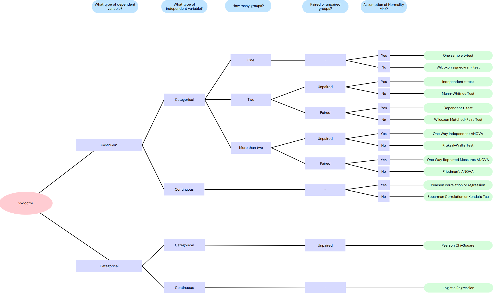

# vvdoctor <a href='https://github.com/vusaverse/vvdoctor'></a>

<!-- badges: start -->

[](https://github.com/vusaverse/vvdoctor/actions/workflows/check-standard.yaml)

[](https://www.codefactor.io/repository/github/vusaverse/vvdoctor)
<!-- badges: end -->

`vvdoctor` is an R package/Shiny app that provides a user-friendly interface for data analysis. It allows users to upload data files, visualize the data, perform statistical tests, and interpret the results.

The app is currently live on shinyapps.io, see: https://edulytics.shinyapps.io/vvdoctor/

## Usage

``` r
## Install the app
devtools::install_github("vusaverse/vvdoctor")
library(vvdoctor)

## run the app
vvdoctor::run_vvdoctor()
```

-   Uploading Data Files: Click on the "Browse" button to select and upload your data file in CSV or Excel format.

-   Displaying the Dataframe: Once the data file is uploaded, the app will display the data as a dataframe. You can explore the data by scrolling through the table or using the search and filter options.

-   Generating a Histogram: To generate a histogram of a specific variable, select a numeric dependent variable from the dropdown menu. The histogram will be displayed, allowing you to visualize the distribution of the data.

-   Choosing Dependent and Independent Variables: To perform statistical tests, select the dependent and independent variables from the respective dropdown menus. The available variables will be automatically populated based on the uploaded data.

-   Statistical Test Options: Once the variables are selected, the app will provide a list of statistical test options, such as t-tests, ANOVA, or correlation analysis. Choose the desired test and click on the "Run Test" button. The output of the test will be displayed, including the test statistic, p-value, and any additional relevant information.


## Supported File Extensions

Currently, the following file types are supported:

| Full File Type Name | Full Extension Name | Package | Read Function | Parsable Arguments |
|----------------------|---------------------|---------|---------------|--------------------|
| R Data File       | .RData           | base  | readRDS     | None             |
| ASCII Text File    | .asc             | utils | read.table  | None             |
| Comma Separated Values File | .csv | utils | read.csv       | sep, header      |
| Apache Feather File | .feather         | feather | read_feather | None             |
| Fixed-Size File    | .fst             | fst   | read_fst    | None             |
| Apache Parquet File | .parquet         | arrow | read_parquet | None             |
| R Data File       | .rda             | base  | readRDS     | None             |
| R Data File       | .rds             | base  | readRDS     | None             |
| SPSS Data File     | .sav             | haven | read_sav    | None             |
| Tab Separated Values File | .tsv | utils | read.delim      | sep, header      |
| Text File          | .txt             | utils | read.delim  | sep, header      |
| Microsoft Excel File | .xlsx            | readxl | read_excel  | None             |


## Decision Tree for Statistical Test Selection

Based on the characteristics of the input data, the `vvdoctor` app uses the following decision tree to select the appropriate statistical test:



This flowchart illustrates the process of selecting a statistical test based on the class of independent/dependent variables, whether the test is paired or unpaired, and whether the data is normally distributed. 

## Overview of Implemented Statistical Test

The table below serves as a reference for understanding the logic behind the app's functionality, 
showcasing how different statistical tests are executed through various R packages and functions.

| Statistical Test Name                                      | R Package | R Function (from the package) |
|------------------------------------------------------------|------------|---------------------------------|
| Sign Test                                                 | DescTools | SignTest()                      |
| Wilcoxon Signed Rank Test                                 | stats      | wilcox.test()                   |
| Mann-Whitney U Test                                        | stats      | wilcox.test()                   |
| Kruskal-Wallis Test                                        | stats      | kruskal.test()                 |
| One Sample t-test                                          | stats      | t.test()                        |
| Paired t-test                                              | stats      | t.test()                        |
| Independent Samples t-test                                 | stats      | t.test()                        |
| Repeated Measures ANOVA                                    | ez         | ezANOVA()                       |
| One-way ANOVA                                              | stats      | aov()                           |
| Chi-Square Goodness-of-Fit and Binomial Test               | stats      | chisq.test()                    |
| McNemar's Test                                             | exact2x2   | exact2x2()                      |
| Chi-Square Test for Independence and Fisher's Exact Test | stats      | chisq.test()                    |
| Bhapkar's Test                                             | irr        | bhapkar()                       |


## Example

Below is a screenshot of an example in `vvdoctor`.


